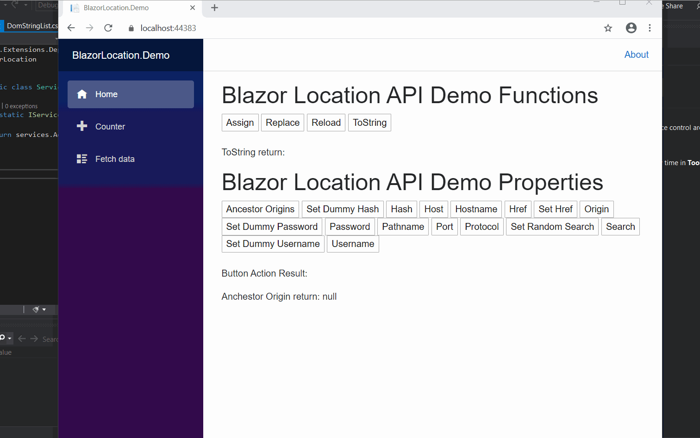

# BlazorLocation

    	

HTML5 Location API for Blazor without any JavaScript Library Dependency.

This package wraps [HTML5 Location](https://developer.mozilla.org/en-US/docs/Web/API/Location) APIs. 

## Installation

`Install-Package BlazorLocation -Version 1.0.0`

## Register the service in your services method

`services.AddBlazorLocation();`

## No javascript library reference dependency

This library has no javascript library reference dependency.

## Usage

`[Inject] IBlazorLocationService BlazorLocation { get; set; }`

### BlazorHistory Methods

<table>
	<tr>
		<th>BlazorLocation</th>
		<th>Method</th>
	</tr>
	<tr>
		<td>Read-only property of the Location interface is a static DOMStringList containing</td>
		<td>AncestorOrigins()</td>
	</tr>
	<tr>
		<td>The hash property of the Location interface returns a USVString containing a '#' followed by the fragment identifier of the URL</td>
		<td>Hash()</td>
	</tr>
  <tr>
		<td>The hash property of the Location interface returns a USVString containing a '#' followed by the fragment identifier of the URL</td>
		<td>Hash(string value)</td>
	</tr>
	<tr>
		<td>The host property of the Location interface is a USVString containing the host, that is the hostname, and then, if the port of the URL is nonempty, a ':', and the port of the URL.</td>
		<td>Host()</td>
	</tr>
    <tr>
		<td>The host property of the Location interface is a USVString containing the host, that is the hostname, and then, if the port of the URL is nonempty, a ':', and the port of the URL.</td>
		<td>Host(string value)</td>
	</tr>
    <tr>
		<td>The hostname property of the Location interface is a USVString containing the domain of the URL.</td>
		<td>Hostname()</td>
	</tr>
    <tr>
		<td>The hostname property of the Location interface is a USVString containing the domain of the URL.</td>
		<td>Hostname(string value)</td>
	</tr>
    <tr>
		<td>The href property of the Location interface is a stringifier that returns a USVString containing the whole URL, and allows the href to be updated.</td>
		<td>Href()</td>
	</tr>
    <tr>
		<td>The href property of the Location interface is a stringifier that returns a USVString containing the whole URL, and allows the href to be updated.</td>
		<td>Href(string value)</td>
	</tr>
    <tr>
		<td>The origin read-only property of the Location interface is a USVString containing the Unicode serialization of the origin of the represented URL.</td>
		<td>Origin()</td>
	</tr>
  </tr>
  <tr>
		<td>The password property of the Location interface is a USVString containing the password specified before the domain name.</td>
		<td>Password()</td>
	</tr>
  </tr>
    <tr>
		<td>The password property of the Location interface is a USVString containing the password specified before the domain name.</td>
		<td>Password(string value)</td>
	</tr>
  <tr>
		<td>The port property of the Location interface is a USVString containing the port number of the URL. If the URL does not contain an explicit port number, it will be set to ''.</td>
		<td>Port()</td>
	</tr>
  </tr>
    <tr>
		<td>The port property of the Location interface is a USVString containing the port number of the URL. If the URL does not contain an explicit port number, it will be set to ''.</td>
		<td>Port(string value)</td>
	</tr>
  <tr>
		<td>The protocol property of the Location interface is a USVString representing the protocol scheme of the URL, including the final ':'.</td>
		<td>Protocol()</td>
	</tr>
  </tr>
    <tr>
		<td>The protocol property of the Location interface is a USVString representing the protocol scheme of the URL, including the final ':'.</td>
		<td>Protocol(string value)</td>
	</tr>
  <tr>
		<td>The search property of the Location interface is a search string, also called a query string; that is, a USVString containing a '?' followed by the parameters of the URL.</td>
		<td>Search()</td>
	</tr>
  </tr>
    <tr>
		<td>The search property of the Location interface is a search string, also called a query string; that is, a USVString containing a '?' followed by the parameters of the URL.</td>
		<td>Search(string value)</td>
	</tr>
  <tr>
		<td>The username property of the Location interface is a USVString containing the username specified before the domain name.</td>
		<td>Username()</td>
	</tr>
  </tr>
    <tr>
		<td>The username property of the Location interface is a USVString containing the username specified before the domain name.</td>
		<td>Username(string value)</td>
	</tr>
  </tr>
    <tr>
		<td>The protocol property of the Location interface is a USVString representing the protocol scheme of the URL, including the final ':'.</td>
		<td>Protocol(string value)</td>
	</tr>
  <tr>
		<td>This method causes the window to load and display the document at the URL specified.</td>
		<td>Assign(string url)</td>
	</tr>
  </tr>
    <tr>
		<td>This method reloads the current URL, like the browser refresh button.</td>
		<td>Reload()</td>
	</tr>
  <tr>
		<td>The replace method of the Location interface replaces the current resource with the one at the provided URL.</td>
		<td>Replace(string url)</td>
	</tr>
  </tr>
    <tr>
		<td>This stringifier method of the Location interface returns a USVString containing the whole URL. It is a read-only version of Location.href.</td>
		<td>ToString()</td>
	</tr>
</table>

## License
MIT
